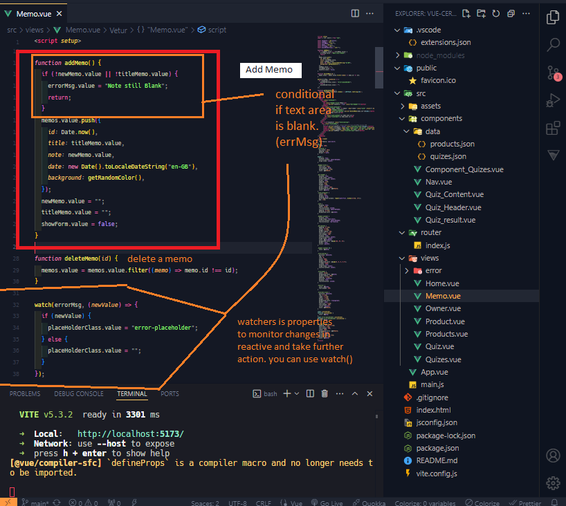

# vue-certification

This template should help get you started developing with Vue 3 in Vite.

# About

Dalam kelas "Belajar Vue 3," disini adalah hasil project dari codepolitan yang akan mempelajari dasar-dasar framework JavaScript Vue.js versi terbaru.
Kelas ini dirancang untuk membantu menguasai Vue 3, mulai dari konsep dasar hingga penerapannya dalam pengembangan aplikasi web modern.

# Tujuan Umum dan Khusu Pelatihan

- Memahami konsep dasar Vue.js dan fitur-fitur terbaru di Vue 3.
- Menguasai teknik pengembangan aplikasi web menggunakan Vue 3
- Mampu membuat dan mengelola komponen Vue dengan baik

# Silabus

- Pengenalan Vue.js: Memahami dasar-dasar dan keunggulan menggunakan Vue.js
- Fitur Baru di Vue 3: Eksplorasi fitur-fitur terbaru yang ditawarkan oleh Vue 3.
- Router: menggunakan Vue Router untuk navigasi

# Metode Belajar

- Pmebelajaran Mandiri Online: Kamu dapat menentukan sendiri waktu belajarmu
- Materi Berupa Video: Materi pembelajaran disajikan dalam bentuk video yang mudah dipahami
- Forum Tanya Jawab: Fasilitas untuk berdiskusi dan bertanya mengenai materi pelajaran

Kelas ini cocok untuk siapa saja yang tertarik dalam pengembangan aplikasi web dan ingin mempelajari Vue 3. Dengan mengikuti kelas ini, kamu akan memperoleh keterampilan yang diperlikan untuk membangun aplikasi web yang modern dan interaktif menggunakan Vue.js.

## Recommended IDE Setup

[VSCode](https://code.visualstudio.com/) + [Volar](https://marketplace.visualstudio.com/items?itemName=Vue.volar) (and disable Vetur).

## Customize configuration

See [Vite Configuration Reference](https://vitejs.dev/config/).

## Project Setup

```sh
npm install
```

### Compile and Hot-Reload for Development

```sh
npm run dev
```

### Compile and Minify for Production

```sh
npm run build
```

## Feature in App

- memo
- Quizes
- Products

### Memo


Source Code function addMemo(), deleteMemo(), wathc()


- Add Memo
  fungsi ini untuk menambahkan Memo, yang di dalamnya terdapat sebauh kondisi apakah field memo tersebut kosong atau tidak ada. Apabila kosong dan melakukan proses tambah dengan klick tambah maka akan tampil pesan error "Note Still Blank..." sebagai variable errMsg kemudian akan mengirimkannya sebagai parameter di properti wathc() setelah itu jika terisi maka akan melanjutkan proses penambahan memo pada method memo.value.push().
  
- Delete Memo
  fungsi ini menerima parameter id dari data memo yang sudah di simpan dan akan melakukan filter pada memo.value berdasarkan memo.id dengan parameter filternya(memo)apakah tidak sama dengan id yang ada di parameter deleteMemo()
  
